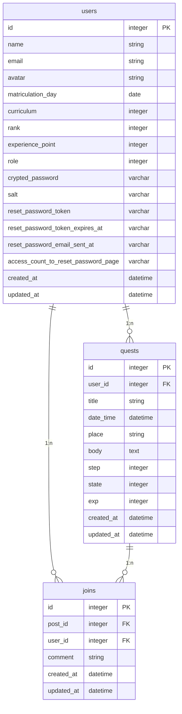

```mermaid
erDiagram

users ||--o{ quests: "1:n"
users ||--o{ joins: "1:n"
quests ||--o{ joins: "1:n"


users {
  id integer PK
  name string
  email string
  avatar string
  matriculation_day date
  curriculum integer
  rank integer
  experience_point integer
  role integer
  crypted_password varchar
  salt varchar
  reset_password_token varchar
  reset_password_token_expires_at varchar
  reset_password_email_sent_at varchar
  access_count_to_reset_password_page varchar
  created_at datetime
  updated_at datetime
}

quests {
  id integer PK
  user_id integer FK
  title string
  date_time datetime
  place string
  body text
  step integer
  state integer
  exp integer
  created_at datetime
  updated_at datetime
}

joins {
  id integer PK
  post_id integer FK
  user_id integer FK
  comment string
  created_at datetime
  updated_at datetime
}
```
